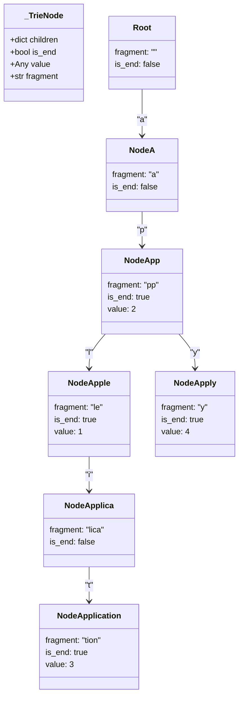
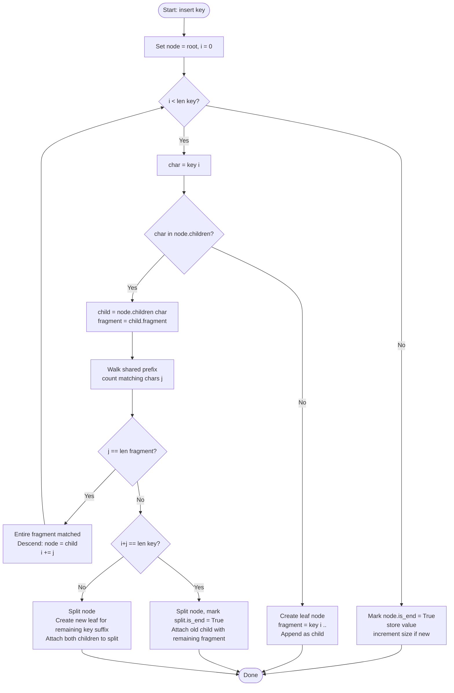
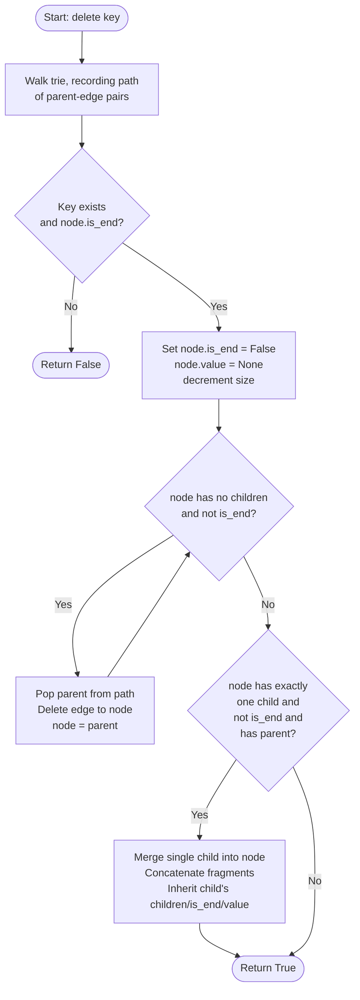
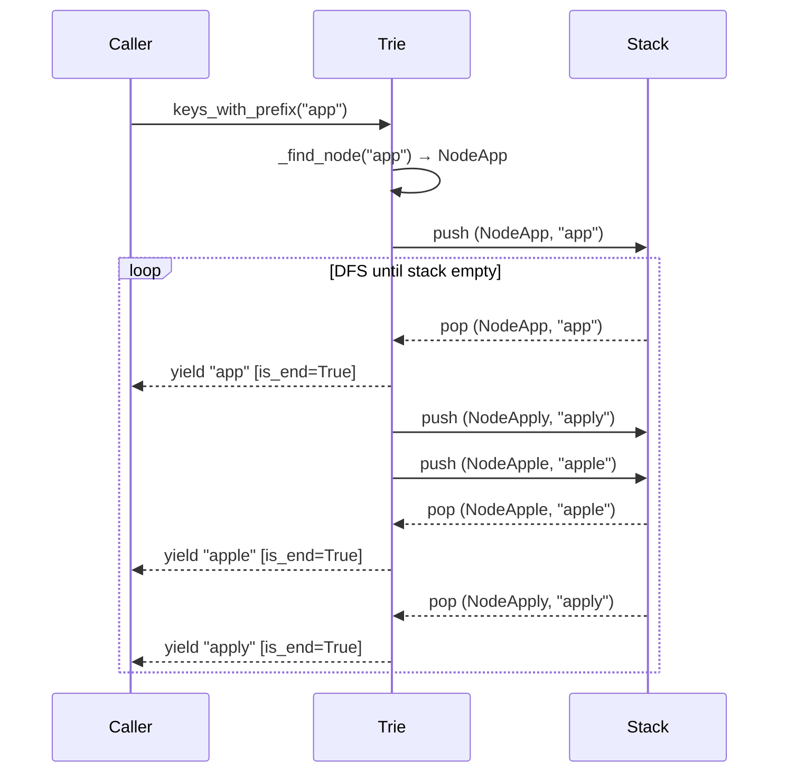
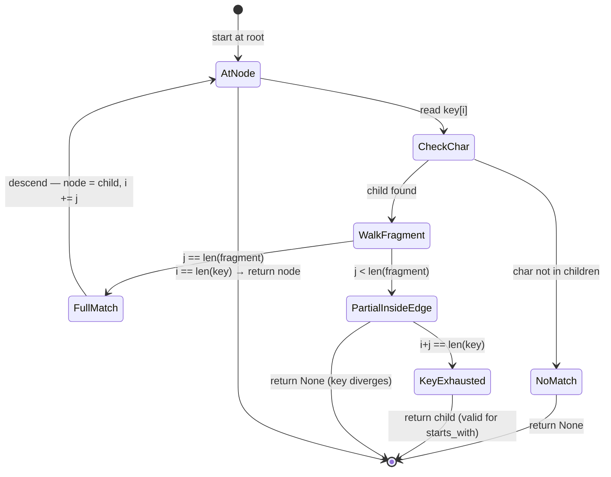

# Code Examples Documentation

## `code-example/trie.py`

**Language:** Python 3.10+  
**Purpose:** A compressed prefix tree (Patricia/Radix Trie) that maps arbitrary string keys to arbitrary values.  
**Dependencies:** Standard library only (`dataclasses`, `typing`).

### Description

`trie.py` implements a **path-compressed Trie** (also known as a Radix Tree or Patricia Tree). Instead of storing one character per node, consecutive single-child nodes are collapsed into a single node holding a multi-character **fragment**. This reduces memory consumption and speeds up lookups on keys with long shared prefixes.

Key design choices:

| Technique | Details |
|---|---|
| **Path compression** | Chains of single-child nodes are merged into one node with a `fragment` label. |
| **Iterative traversal** | All public methods use `while` loops instead of recursion — O(1) stack space. |
| **Lazy generator enumeration** | `keys_with_prefix` and `__iter__` yield results via an explicit DFS stack, keeping memory low for large tries. |

**Complexity**

| Operation | Time |
|---|---|
| `insert(key)` | O(n) — n = key length |
| `search(key)` | O(n) |
| `delete(key)` | O(n) |
| `starts_with(prefix)` | O(n) |
| `keys_with_prefix(prefix)` | O(n + m) — m = number of matches |

### Public API

```python
trie = Trie()

trie.insert("apple", 1)      # map "apple" → 1
trie.search("apple")         # → 1   (None if absent)
trie.starts_with("app")      # → True
trie.delete("apple")         # → True (False if key not found)
list(trie.keys_with_prefix("app"))  # → ["app", "application", ...]
len(trie)                    # number of inserted keys
"apple" in trie              # membership test via __contains__
list(trie)                   # all keys via __iter__
```

### Key Classes

#### `_TrieNode` (internal dataclass)

```python
@dataclass
class _TrieNode:
    children: dict[str, _TrieNode]  # keyed by first char of child's fragment
    is_end: bool                    # True if this node terminates a key
    value: Any                      # stored value for terminal nodes
    fragment: str                   # compressed edge label from parent
```

#### `Trie`

The public class. Maintains a `_root` `_TrieNode` and a `_size` counter.  
Internal helper `_find_node(key)` walks the tree and returns the landing node (or `None`), shared by `search`, `starts_with`, `delete`, and `keys_with_prefix`.

---

### Diagrams

#### Data structure layout

The diagram below shows the compressed node structure after inserting `"app"`, `"apple"`, `"application"`, and `"apply"`.



---

#### `insert` flowchart

Step-by-step control flow when inserting a new key into the trie.



---

#### `delete` flowchart

The delete operation walks down tracking the parent path, removes the terminal marker, then cleans up orphaned nodes and re-merges single-child internal nodes bottom-up.



---

#### `keys_with_prefix` sequence diagram

Walkthrough of enumerating all keys with prefix `"app"` from a trie containing `"app"`, `"apple"`, and `"apply"`.



---

#### `_find_node` state diagram

Internal traversal states while walking a compressed edge.


