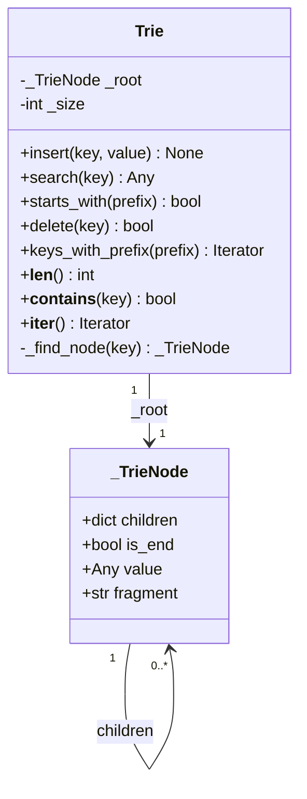
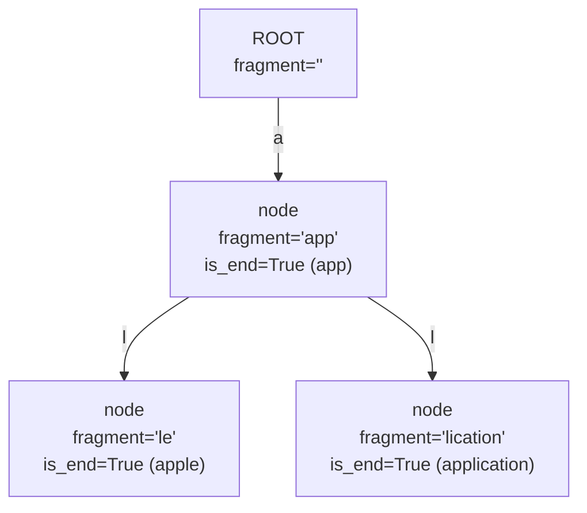
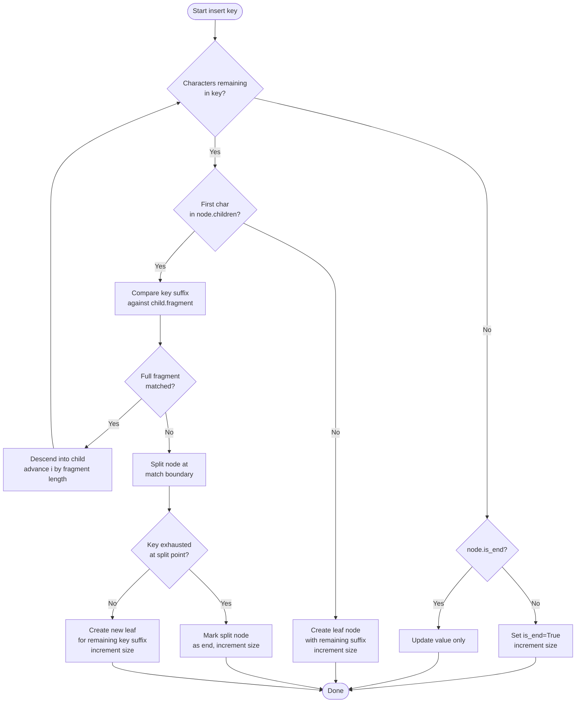
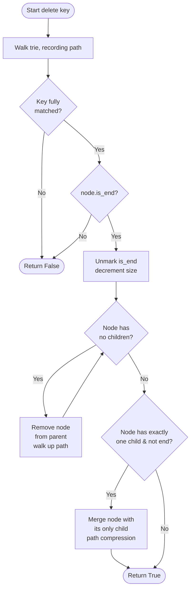
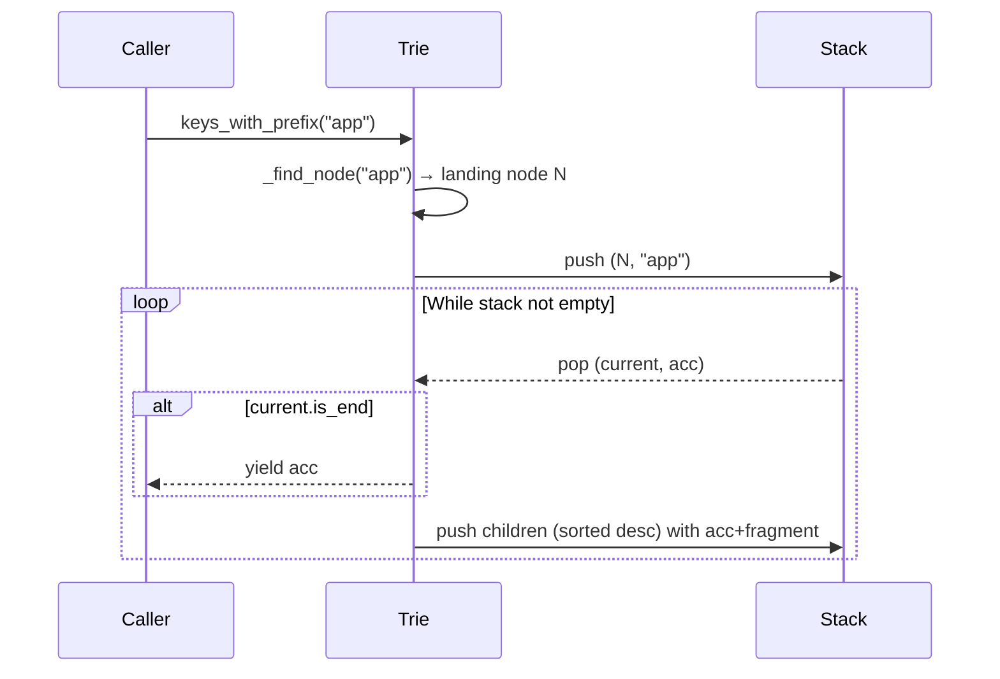
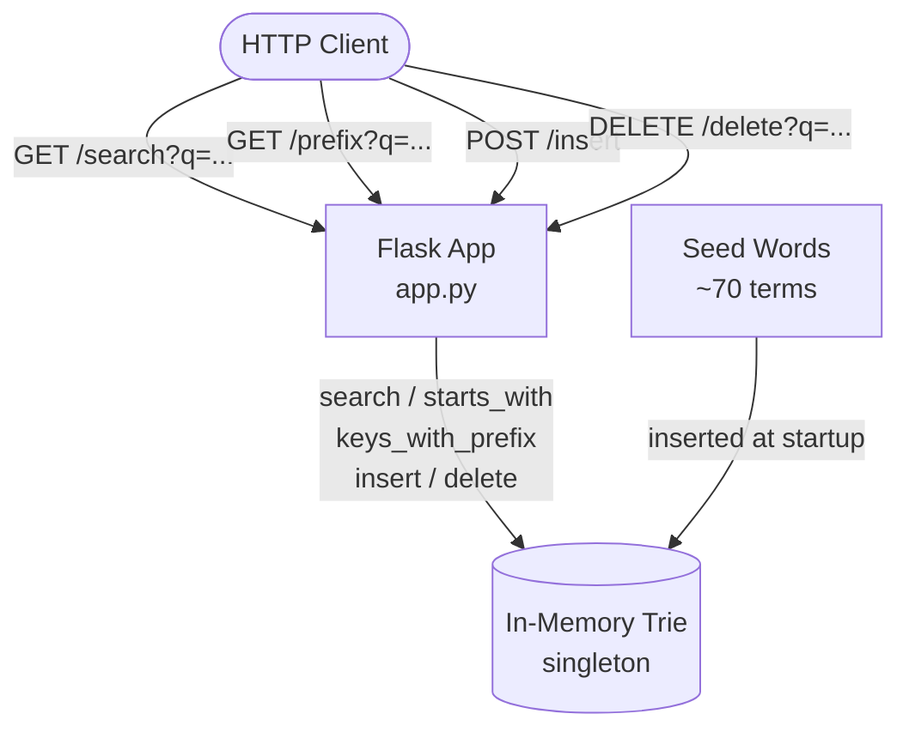
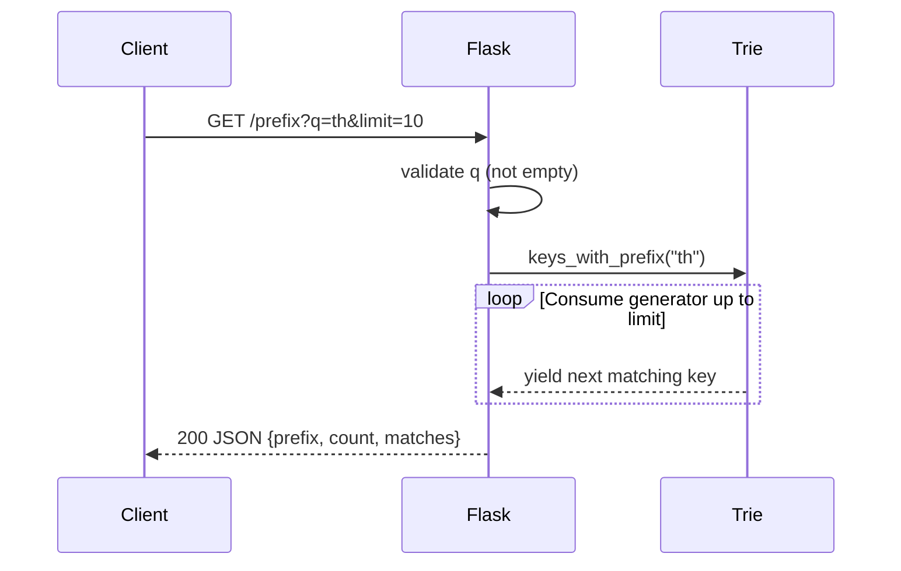
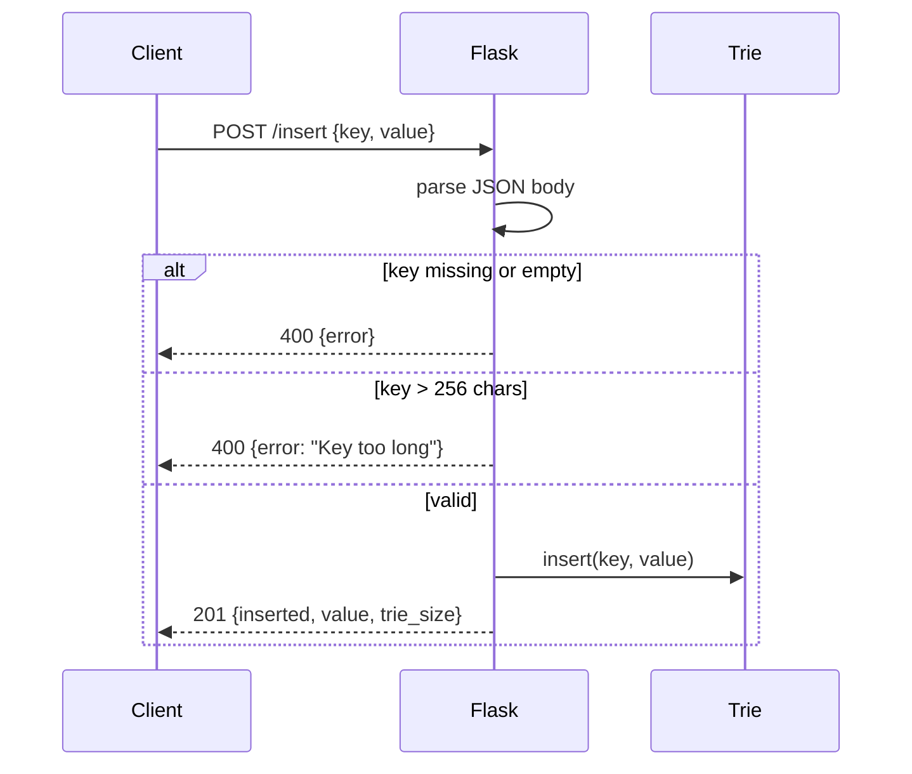
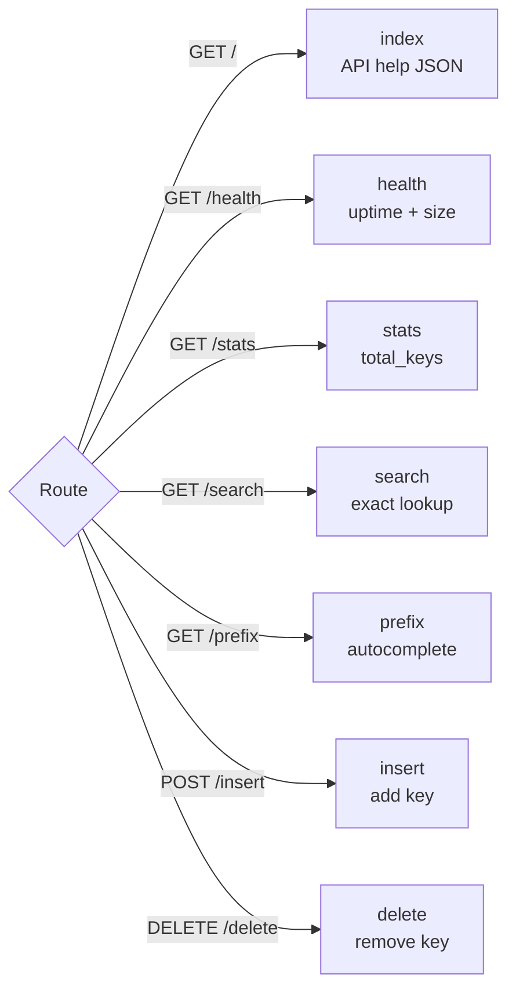
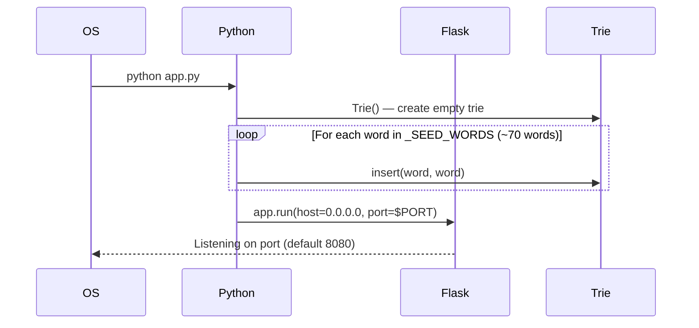

# Code Examples Documentation

This document describes every file inside the `code-example/` folder of this repository.

---

## `code-example/trie.py`

**Language:** Python 3.10+  
**Purpose:** Stand-alone implementation of a compressed Prefix Tree (Trie) with path compression, iterative traversal, and lazy generator-based enumeration.  
**Dependencies:** Standard library only (`dataclasses`, `typing`)

### Description

`trie.py` defines two classes:

| Class | Role |
|---|---|
| `_TrieNode` | Internal dataclass representing a single node. Stores child pointers, an end-of-word flag, the associated value, and a **fragment** string (the edge label used for path compression). |
| `Trie` | Public API. A compressed prefix tree that maps arbitrary string keys to arbitrary values. |

**Key techniques:**

- **Path compression** — consecutive single-child chains are collapsed into one node whose `fragment` holds the full shared substring. This reduces memory and speeds up traversal on long keys with common prefixes.
- **Iterative traversal** — `insert`, `search`, `delete`, and `_find_node` use `while` loops instead of recursion, keeping the call stack O(1) regardless of key length.
- **Generator-based enumeration** — `keys_with_prefix` and `__iter__` use an explicit DFS stack and `yield`, so even a trie holding millions of entries is enumerated lazily.

### Public API

```python
t = Trie()
t.insert("apple", 1)          # Insert key → value
t.search("apple")             # → 1  (None if absent)
t.starts_with("app")          # → True
t.delete("apple")             # → True if deleted
list(t.keys_with_prefix("ap"))# → ['app', 'apple', ...]
len(t)                        # → number of stored keys
"apple" in t                  # → bool (uses search)
```

### Complexity

| Operation | Time |
|---|---|
| `insert` / `search` / `delete` | O(n) — n = key length |
| `starts_with` | O(n) |
| `keys_with_prefix` | O(n + m) — m = number of matches |

### Diagrams

#### Data Structure Layout

The class diagram below shows the relationship between `Trie` and `_TrieNode`.



#### Path-Compressed Tree Example

After inserting `"app"`, `"apple"`, and `"application"`, the internal tree looks like this (each box is a `_TrieNode`, edge labels are `fragment` values):



> Note: In practice `apple` and `application` share a further split on `"li"` vs `"le"`, but the diagram above illustrates the concept of fragment-labelled edges.

#### Insert Operation Flowchart



#### Delete Operation Flowchart



#### Prefix Search (`keys_with_prefix`) — Sequence Walkthrough

The following sequence diagram shows how `keys_with_prefix("app")` yields results using an explicit DFS stack.



---

## `code-example/app.py`

**Language:** Python 3.10+  
**Purpose:** Flask REST API that exposes the compressed Trie as a JSON autocomplete / lookup service. Designed for containerised deployment (reads `PORT` from environment, ships a pre-seeded word list).  
**Dependencies:** `flask` (third-party); `dataclasses`, `typing`, `os`, `time`, `logging` (standard library)

### Description

`app.py` embeds the same path-compressed `Trie` / `_TrieNode` implementation from `trie.py` directly in the file and wraps it with a Flask application. On startup it seeds the trie with ~70 common computing terms so the API is useful immediately.

**Global state:**

| Variable | Purpose |
|---|---|
| `trie` | Singleton `Trie` instance shared across all requests |
| `_start_time` | `time.time()` at process start, used by `/health` and `/stats` |
| `_SEED_WORDS` | List of ~70 seed terms inserted at import time |

### Endpoints

| Method | Path | Query / Body | Description |
|---|---|---|---|
| `GET` | `/` | — | JSON help page listing all endpoints |
| `GET` | `/health` | — | Liveness probe: `status`, `uptime_seconds`, `trie_size` |
| `GET` | `/stats` | — | Trie statistics: `total_keys`, `uptime_seconds`, `seed_words` |
| `GET` | `/search` | `?q=<key>` | Exact-match lookup; returns `found` bool and `value` |
| `GET` | `/prefix` | `?q=<pfx>&limit=<n>` | Autocomplete; returns up to `limit` (default 25) matching keys |
| `POST` | `/insert` | `{"key": "...", "value": "..."}` | Insert a key (max 256 chars); returns `trie_size` |
| `DELETE` | `/delete` | `?q=<key>` | Delete a key; 404 if not found |

### Example Usage

```bash
# Autocomplete
curl "http://localhost:8080/prefix?q=th"
# → {"prefix":"th","count":3,"matches":["thread","token","tree"]}

# Insert a custom word
curl -X POST http://localhost:8080/insert \
     -H "Content-Type: application/json" \
     -d '{"key": "terraform", "value": "infrastructure as code"}'

# Exact search
curl "http://localhost:8080/search?q=flask"
# → {"key":"flask","found":true,"value":"flask"}
```

### Diagrams

#### Service Architecture



#### Request Lifecycle — Autocomplete (`GET /prefix`)



#### Request Lifecycle — Insert (`POST /insert`)



#### Endpoint Routing Overview



#### Application Startup Sequence


