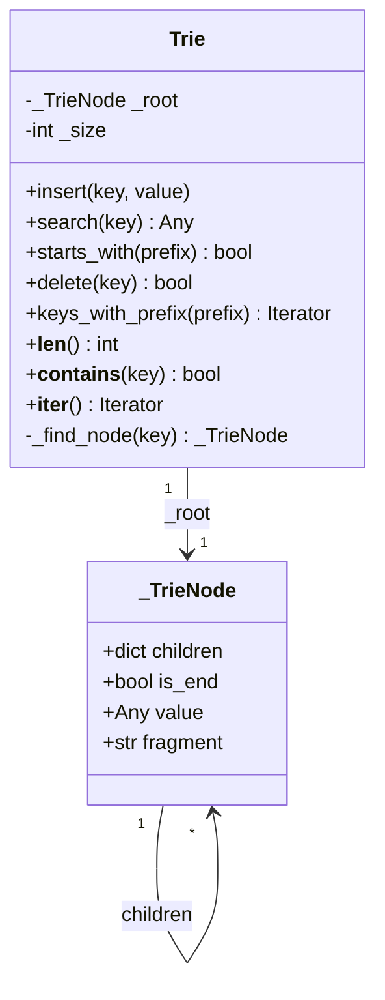
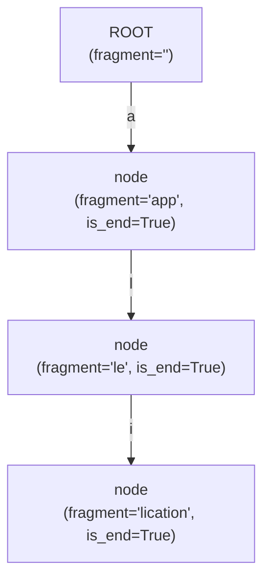
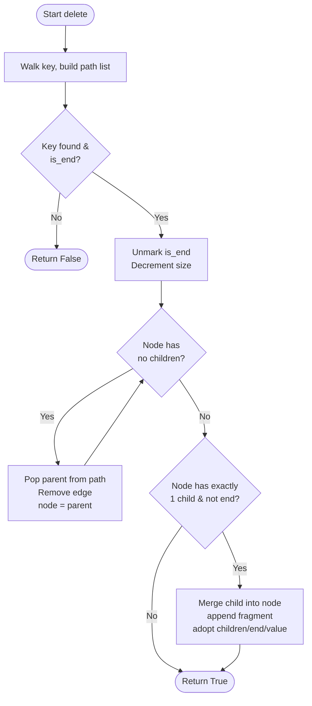
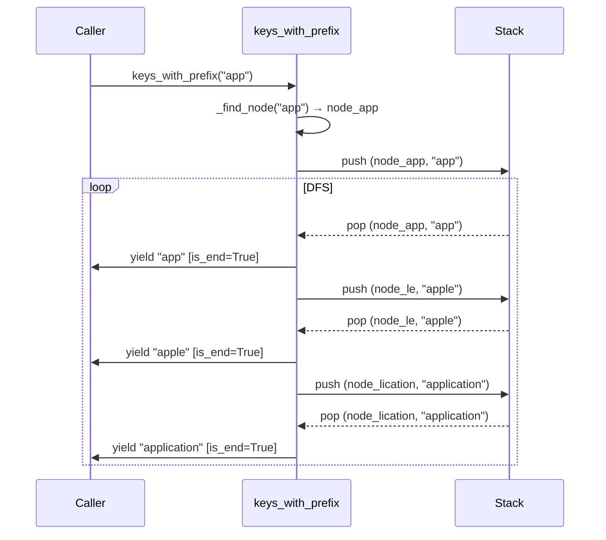
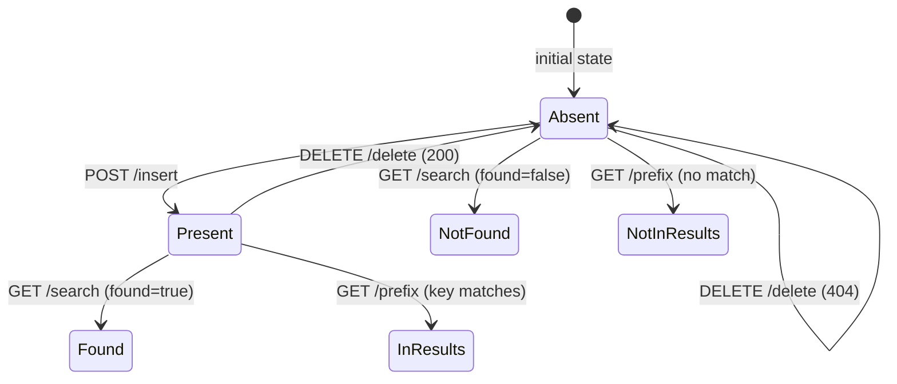
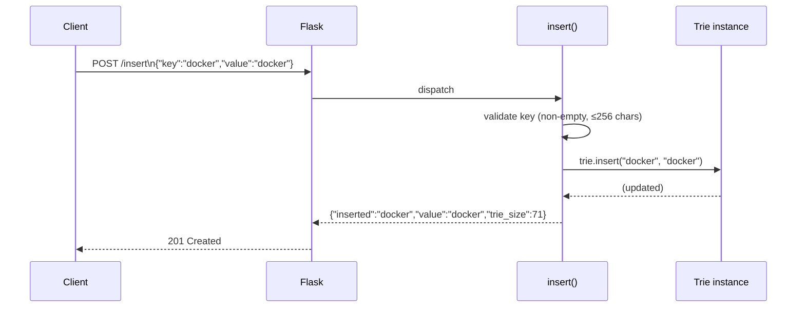
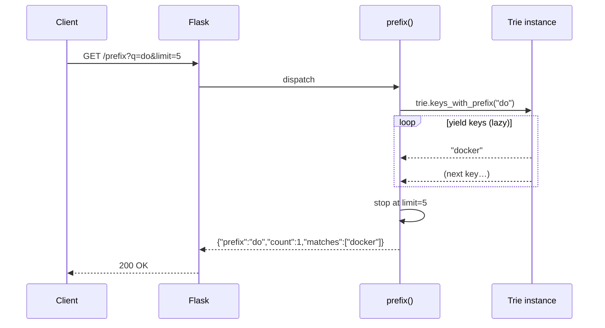
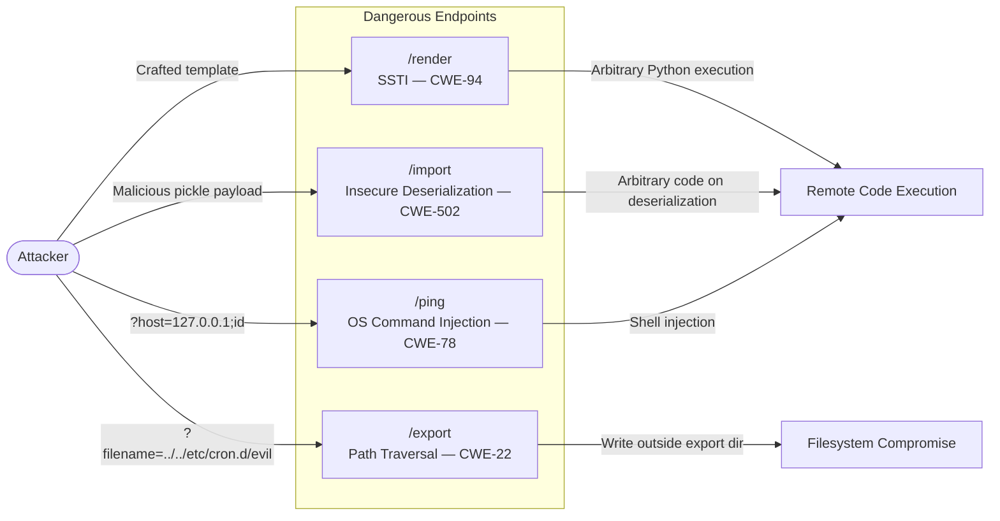

# Code Examples Documentation

This document describes every file in the `code-example/` folder.

---

## `code-example/trie.py`

**Language:** Python 3.10+  
**Purpose:** Standalone, production-quality implementation of a **compressed Trie** (Patricia / Radix tree) that maps arbitrary string keys to values.  
**Dependencies:** Python standard library only (`dataclasses`, `typing`)

### Description

`trie.py` implements a *path-compressed* prefix tree.  Rather than storing one character per node, each edge carries a **fragment** string, collapsing long single-child chains into a single node.  All public methods are **iterative** (no recursion) and the key-enumeration methods are **lazy generators**, keeping both call-stack and memory usage constant.

### Key Types & Functions

| Symbol | Kind | Description |
|---|---|---|
| `_TrieNode` | dataclass | Internal node: `children` dict, `is_end` flag, `value`, and compressed `fragment` |
| `Trie` | class | Public API — see methods below |
| `Trie.insert(key, value)` | method | O(n) insert with path compression and node splitting |
| `Trie.search(key)` | method | O(n) exact match; returns value or `None` |
| `Trie.starts_with(prefix)` | method | O(n) prefix existence check |
| `Trie.delete(key)` | method | O(n) removal with bottom-up cleanup and node re-merging |
| `Trie.keys_with_prefix(prefix)` | method | O(n+m) lazy DFS generator over matching keys |
| `Trie._find_node(key)` | method | Shared traversal helper |

### Complexity

| Operation | Time |
|---|---|
| `insert` / `search` / `delete` | O(n) — n = key length |
| `starts_with` | O(n) |
| `keys_with_prefix` | O(n + m) — m = number of matches |

### Quick Usage

```python
t = Trie()
t.insert("apple", 1)
t.insert("app", 2)
t.search("app")            # → 2
t.starts_with("app")       # → True
sorted(t.keys_with_prefix("app"))  # → ['app', 'apple']
t.delete("app")
```

---

### Diagram 1 — Node Structure (Class Diagram)

The class diagram shows how `_TrieNode` and `Trie` relate and what each carries.



---

### Diagram 2 — Compressed Trie Memory Layout (example)

After inserting `"app"`, `"apple"`, `"application"` the tree compresses shared prefixes into single nodes.



---

### Diagram 3 — Insert Operation Flowchart

Step-by-step control flow of `Trie.insert(key, value)`.

```mermaid
flowchart TD
    A([Start insert]) --> B[i = 0, node = root]
    B --> C{i < len key?}
    C -->|No| M[Mark node as end, set value]
    M --> Z([Done])
    C -->|Yes| D{char in node.children?}
    D -->|No| E[Create leaf node\nfragment = key\[i:\]\nis_end = True]
    E --> Z
    D -->|Yes| F[child = node.children\[char\]\nMatch key vs fragment]
    F --> G{Full fragment\nmatched?}
    G -->|Yes| H[Descend: node = child\ni += len fragment]
    H --> C
    G -->|No| I{Key exhausted\nat split point?}
    I -->|Yes| J[Create split node\nMark split as end]
    J --> Z
    I -->|No| K[Create split node +\nnew leaf for remainder]
    K --> Z
```

---

### Diagram 4 — Delete Operation Flowchart

`Trie.delete` walks down recording a `path`, unmarks the terminal node, then prunes empty childless nodes bottom-up and re-merges single-child internal nodes.



---

### Diagram 5 — `keys_with_prefix` Traversal (Sequence)

Illustrates a lazy DFS enumeration for prefix `"app"` on a trie containing `"app"`, `"apple"`, `"application"`.



---

## `code-example/app.py`

**Language:** Python 3.10+  
**Purpose:** Flask-based **REST API** that exposes the compressed Trie as an autocomplete / lookup service.  
**Dependencies:** `flask` (third-party); embeds the same `Trie` / `_TrieNode` implementation from `trie.py` inline.

### Description

`app.py` wraps the Trie in a JSON API server.  On startup it seeds a global `Trie` instance with ~70 computing vocabulary words.  All endpoints operate on this single in-process instance.  The file also contains **four intentional security-vulnerability examples** clearly documented with CWE references (SSTI, Path Traversal, Insecure Deserialization, OS Command Injection) for educational / demonstration purposes.

### API Endpoints

| Method | Path | Description |
|---|---|---|
| `GET` | `/` | Landing page — lists all endpoints |
| `GET` | `/health` | Liveness probe: status, uptime, trie size |
| `GET` | `/stats` | Trie statistics |
| `GET` | `/search?q=<key>` | Exact match lookup |
| `GET` | `/prefix?q=<pfx>[&limit=N]` | Autocomplete — all keys starting with prefix (default limit 25) |
| `POST` | `/insert` | Insert `{"key": "...", "value": "..."}` |
| `DELETE` | `/delete?q=<key>` | Delete a key |
| `GET` | `/render?template=<tpl>` | ⚠️ SSTI demo — renders caller-supplied Jinja2 template |
| `GET` | `/export?filename=<f>` | ⚠️ Path-traversal demo — exports keys to file |
| `POST` | `/import` | ⚠️ Insecure deserialization demo — restores from pickle snapshot |
| `GET` | `/ping?host=<h>` | ⚠️ OS command injection demo — pings an arbitrary host |

### Security Notes (intentional vulnerabilities for demo purposes)

| Endpoint | CWE | Description |
|---|---|---|
| `/render` | CWE-94 (SSTI) | Raw user template injected into `render_template_string` |
| `/export` | CWE-22 (Path Traversal) | `filename` concatenated without sanitisation |
| `/import` | CWE-502 (Insecure Deserialization) | `pickle.loads` on attacker-controlled base64 data |
| `/ping` | CWE-78 (OS Command Injection) | `host` interpolated into a shell command |

---

### Diagram 6 — Service Architecture (Flowchart)

High-level request lifecycle in `app.py`.

```mermaid
flowchart TD
    Client([HTTP Client])
    Flask[Flask Router]
    TrieInstance[(Global Trie\nin-process)]

    Client -->|HTTP Request| Flask
    Flask -->|GET /search| SearchHandler[search()]
    Flask -->|GET /prefix| PrefixHandler[prefix()]
    Flask -->|POST /insert| InsertHandler[insert()]
    Flask -->|DELETE /delete| DeleteHandler[delete()]
    Flask -->|GET /health| HealthHandler[health()]
    Flask -->|GET /stats| StatsHandler[stats()]

    SearchHandler --> TrieInstance
    PrefixHandler --> TrieInstance
    InsertHandler --> TrieInstance
    DeleteHandler --> TrieInstance
    HealthHandler --> TrieInstance
    StatsHandler --> TrieInstance

    TrieInstance -->|Result| Flask
    Flask -->|JSON Response| Client
```

---

### Diagram 7 — Endpoint State Machine

States a trie key passes through as the API is used.



---

### Diagram 8 — `/insert` Request Flow (Sequence)



---

### Diagram 9 — `/prefix` Autocomplete Flow (Sequence)



---

### Diagram 10 — Intentional Vulnerabilities Overview


